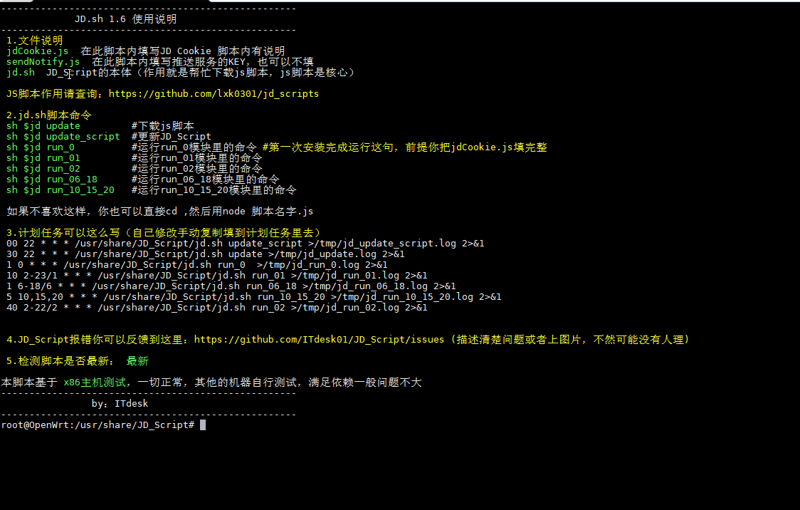

# JD_Script

## 序言
   调用https://github.com/lxk0301/jd_scripts 进行测试学习，在X86机器使用正常，其他机器满足依赖应该问题不大,
   
   **lxk0301大佬的JS脚本里面的助力码替换成我的了，默认会给我助力，如果你不需要自行删除代码或者禁用他**

## 支持系统
openwrt X86 （基于x86编写）

竟斗云路由器（群友极地阳光测试）

N1（群友极地阳光测试）

## Usage 使用方法
## 1.openwrt安装依赖(重要，不好好看，报错自行处理)

**注意（rom小于128M别折腾了，你装不下依赖）**

**1.1开始安装git**
```sh
opkg update
opkg install git 
opkg install git-http
```
**1.2开始安装node(重要 重要 重要)**
```sh
opkg install node
opkg install node-npm
```
**已知问题**node-npm经常找不到，需要更换下载源（源我这边也没有）或者通过ipk方式安装，实在不行考虑重新编译固件，编译的时候加进去

**node和node-npm版本一定要大于10**，安装node和node-npm以后用 opkg list-installed | grep node 查看node版本，两个都要大于10


**1.3执行npm**
方案1（首选）
```sh
npm install -g crypto-js got http-server tough-cookie download request tunnel
```
**成功了就不用理方案2,3，直接到2.开始下载脚本**


方案2

如果你执行安装npm install -g crypto-js got http-server tough-cookie download request tunnel报错，你也可以用以下代码安装
```sh
wget https://raw.githubusercontent.com/lxk0301/jd_scripts/master/package.json

npm install
```
方案3（痴雨提供）
设置NPM 下载源为淘宝 
```sh
npm config set registry https://registry.npm.taobao.org
```
查看当前NPM下载源
```sh
npm config get registry
```
然后再执行
```sh
npm install -g crypto-js got http-server tough-cookie download request tunnel
```

**2.开始下载脚本**
```sh
git clone https://github.com/ITdesk01/JD_Script.git /usr/share/JD_Script
cd /usr/share/JD_Script && chmod 777 jd.sh 
sh jd.sh 
```
**执行sh jd.sh以后会重启一次，所以做好准备（首次运行脚本会这样，以后都不会）**

**重启完成以后**
```sh
sh $jd #直接调用代码

cd $jd_file # 可以直接进入代码所在文件夹
```

**注意**：当你使用一般Linux发行版（如Ubuntu）时，请将```jd.sh```首行的```#!/bin/sh```改为```#!/bin/bash```并修改运行方式为```bash $jd```以避免不同系统shell语法不兼容的情况


**3.问题反馈：https://github.com/ITdesk01/JD_Script/issues (描述清楚问题或者上图片，不然可能没有人理)**

**吹水群** :**667491026** (公子大爷请绕道，白嫖可能没人理)

## 你们可以不好好看安装依赖，我也可以拒绝回答任何问题。


## 特别声明:

* 本仓库发布的JD_Script项目中涉及的任何脚本，仅用于测试和学习研究，禁止用于商业用途，不能保证其合法性，准确性，完整性和有效性，请根据情况自行判断.

* 本项目内所有资源文件，禁止任何公众号、自媒体进行任何形式的转载、发布。

* ITdesk01对任何脚本问题概不负责，包括但不限于由任何脚本错误导致的任何损失或损害.

* 间接使用脚本的任何用户，包括但不限于建立VPS或在某些行为违反国家/地区法律或相关法规的情况下进行传播, ITdesk01对于由此引起的任何隐私泄漏或其他后果概不负责.

* 请勿将JD_Script项目的任何内容用于商业或非法目的，否则后果自负.

* 如果任何单位或个人认为该项目的脚本可能涉嫌侵犯其权利，则应及时通知并提供身份证明，所有权证明，我们将在收到认证文件后删除相关脚本.

* 任何以任何方式查看此项目的人或直接或间接使用该Script项目的任何脚本的使用者都应仔细阅读此声明。ITdesk01保留随时更改或补充此免责声明的权利。一旦使用并复制了任何相关脚本或Script项目的规则，则视为您已接受此免责声明.

 **您必须在下载后的24小时内从计算机或手机中完全删除以上内容.**  </br>
> ***您使用或者复制了本仓库且本人制作的任何脚本，则视为`已接受`此声明，请仔细阅读***
