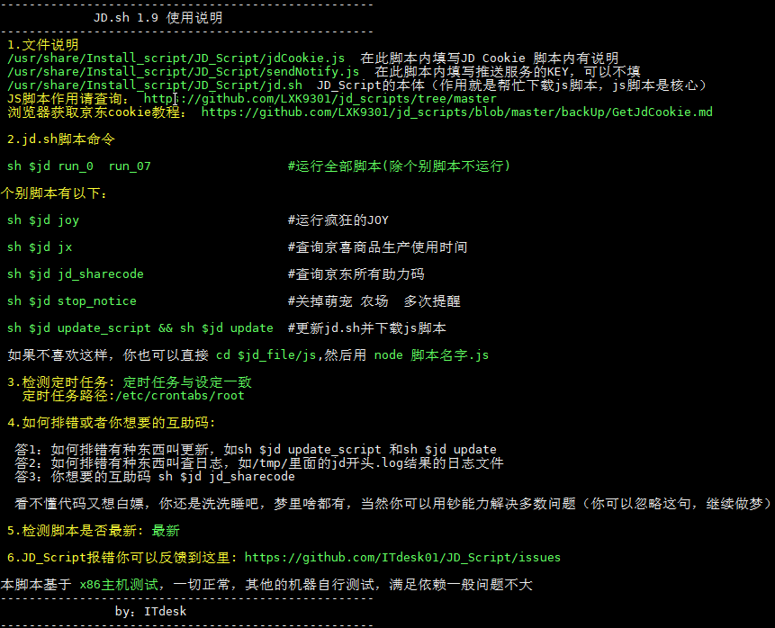

# JD_Script

## 序言
   调用https://github.com/LXK9301/jd_scripts/tree/master 进行测试学习，在X86机器使用正常，其他机器满足依赖应该问题不大,
   
   **lxk0301大佬的JS脚本里面的助力码替换成我的了，默认会给我助力，如果你不需要自行删除代码或者禁用他**

## 支持系统
openwrt X86 （基于x86编写）

竟斗云路由器（群友极地阳光测试）

N1（群友极地阳光测试）

感谢作者lxk0301 shylocks大佬的脚本

**注意1（设备Rom小于128M别折腾了，你装不下依赖，不用往下看了，RAM最好大点1G左右，512M也行就是不能跑太多账号，不然会死机）**

**注意2（linux底子太薄的，建议好好学习一下，这不是无脑脚本，最起码你要看懂底下操作是做啥的）**

## Usage 使用方法
**1.openwrt需要的依赖(重要，不好好看，报错自行处理)**
 
         git
 
         git-http
 
         node 大于10
 
         node-npm 大于10
 

安装办法1

         通过opkg update 再 opkg install git git-http node node-npm

安装办法2

       可以采用我的openwrt插件"Install_script"（不带luci界面）
          https://github.com/openwrtcompileshell/OpenwrtCompileScript/tree/master/package/Install_script
       
        Install_script插件使用办法
          
          1.编译完成以后刷机，开机的等5分钟连上网等自动安装脚本与依赖,是否完成可以查看/usr/share/Install_script/
          
          2.完成以后/usr/share/Install_script/script_config填上cookie
          
          3.sh $jd && sh $jd run_0 run_07 #运行全部脚本
        
        如果安装失败可以用以下命令控制插件安装
          /etc/init.d/Install_script start
        
        删除插件安装的所有脚本
          /etc/init.d/Install_script stop
        
        不会编译的可以采用我的编译辅助脚本编译： https://github.com/openwrtcompileshell/OpenwrtCompileScript

**node和node-npm版本一定要大于10**，安装node和node-npm以后用 opkg list-installed | grep node 查看node版本，两个都要大于10

**2.安装完依赖以后用npm安装一些模块**

         npm install -g crypto-js got http-server tough-cookie download request tunnel

**如果你执行安装npm install -g crypto-js got http-server tough-cookie download request tunnel报错，你也可以用以下代码安装**

         wget https://gitee.com/lxk0301/jd_scripts/raw/master/package.json
        
         npm install

**还不行可以采用最后一个办法（痴雨提供）**
设置NPM 下载源为淘宝 

         npm config set registry https://registry.npm.taobao.org

查看当前NPM下载源

         npm config get registry

然后再执行

          npm install -g crypto-js got http-server tough-cookie download request tunnel

**3.开始下载脚本**

         git clone -b main https://github.com/ITdesk01/JD_Script.git /usr/share/JD_Script
         cd /usr/share/JD_Script && chmod 777 jd.sh 
         sh jd.sh 
         

脚本安装完成以后可以用以下代码

         sh $jd #直接调用代码

         cd $jd_file # 可以直接进入代码所在文件夹

##3.已知问题!!!

1.下载下来的js都是空的，建议强制代理raw.githubusercontent.com

2.互助码怎么找

         sh $jd jd_sharecode

**4.问题反馈：https://github.com/ITdesk01/JD_Script/issues (描述清楚问题或者上图片，不然可能没有人理)**

**吹水群** :**667491026** (公子大爷请绕道，白嫖可能没人理)

## 你们可以不好好看安装依赖，我也可以拒绝回答任何问题。

## 特别声明:

* 本仓库发布的JD_Script项目中涉及的任何脚本，仅用于测试和学习研究，禁止用于商业用途，不能保证其合法性，准确性，完整性和有效性，请根据情况自行判断.

* 本项目内所有资源文件，禁止任何公众号、自媒体进行任何形式的转载、发布。

* ITdesk01对任何脚本问题概不负责，包括但不限于由任何脚本错误导致的任何损失或损害.

* 间接使用脚本的任何用户，包括但不限于建立VPS或在某些行为违反国家/地区法律或相关法规的情况下进行传播, ITdesk01对于由此引起的任何隐私泄漏或其他后果概不负责.

* 请勿将JD_Script项目的任何内容用于商业或非法目的，否则后果自负.

* 如果任何单位或个人认为该项目的脚本可能涉嫌侵犯其权利，则应及时通知并提供身份证明，所有权证明，我们将在收到认证文件后删除相关脚本.

* 任何以任何方式查看此项目的人或直接或间接使用该JD_Script项目的任何脚本的使用者都应仔细阅读此声明。ITdesk01保留随时更改或补充此免责声明的权利。一旦使用并复制了任何相关脚本或JD_Script项目的规则，则视为您已接受此免责声明.

 **您必须在下载后的24小时内从计算机或手机中完全删除以上内容.**   
> ***您使用或者复制了本仓库且本人制作的任何脚本，则视为`已接受`此声明，请仔细阅读***
